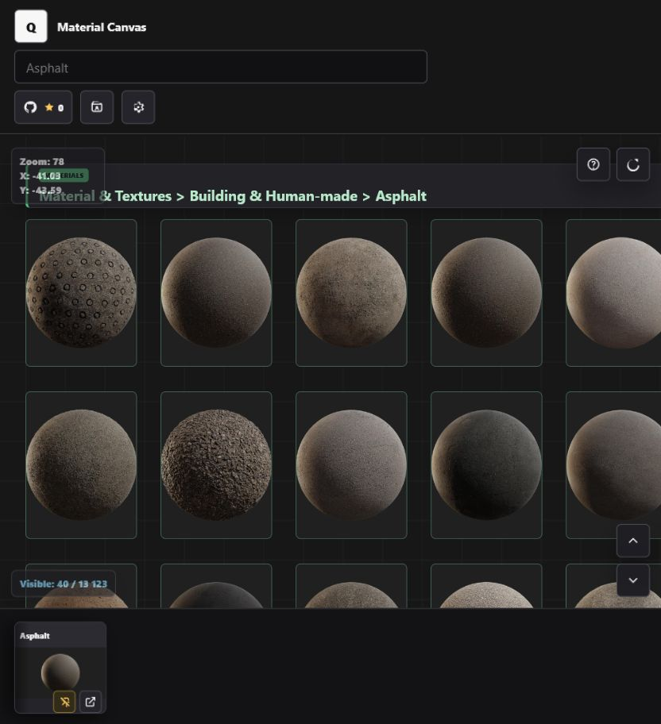

# Material Canvas

Material Canvas is a static React/Vite reference board for browsing a large Quixel asset library. It is built for artists who need to search, compare, pin, and arrange materials, 3D models, decals, and brushes while working on different project profiles.

[Read this document in Russian](README.ru.md)



## Features

- Large zoomable canvas with asset cards grouped by localized category paths.
- Search with autocomplete, recent search history, highlighted matches, and next-result navigation.
- Per-profile Local Storage persistence for zoom, viewport position, pinned cards, free canvas copies, search state, filters, theme, language, and lightweight-card mode.
- Pinned hand with safer hover behavior, larger controls, draggable duplicate cards, and optional fan layout.
- Focus mode for a cleaner canvas view.
- Category jump controls, reset view, visible asset counters, and compact cards at far zoom levels.
- Asset type filtering for Materials, 3D Models, Decals, and Brushes.
- Grouped subcategory selector with localized labels instead of repeated full paths.
- English and Russian UI switcher.
- Static hosting friendly: no backend server is required.

## Hotkeys

- `Tab` accepts search autocomplete.
- `F3` or `Ctrl+G` jumps to the next search match.
- `R` resets the canvas view.
- `F` toggles Focus mode.
- `/` opens or closes the shortcuts panel.
- `E` toggles lightweight cards.
- `Ctrl+Z` undoes the last canvas action.
- `1-9` loads profiles by list order.

## Local Development

```bash
npm ci
npm run dev
```

Open the local URL printed by Vite. The app loads asset data from:

```text
public/data/assets.json
```

## Build

```bash
npm run build
npm run preview
```

The production site is emitted into `dist/`.

## GitHub Pages

This repository includes a GitHub Actions workflow at `.github/workflows/pages.yml`.

1. Push the repository to GitHub.
2. In the repository settings, open **Pages**.
3. Set **Source** to **GitHub Actions**.
4. Push to `master` or run the workflow manually.

The Vite config uses `base: "./"`, so the build works from GitHub Pages project URLs such as:

```text
https://username.github.io/material-canvas/
```

## Data Notes

The demo data in `public/data/assets.json` intentionally includes purchased-state examples. Profiles and user changes are not uploaded anywhere; they are saved only in the browser's Local Storage. Artists can export and import profile JSON files from the profile menu.

## Credits And Feedback

Material Canvas was developed with help from ChatGPT Codex.

Issues, bug reports, and feature requests are welcome in the GitHub repository.
