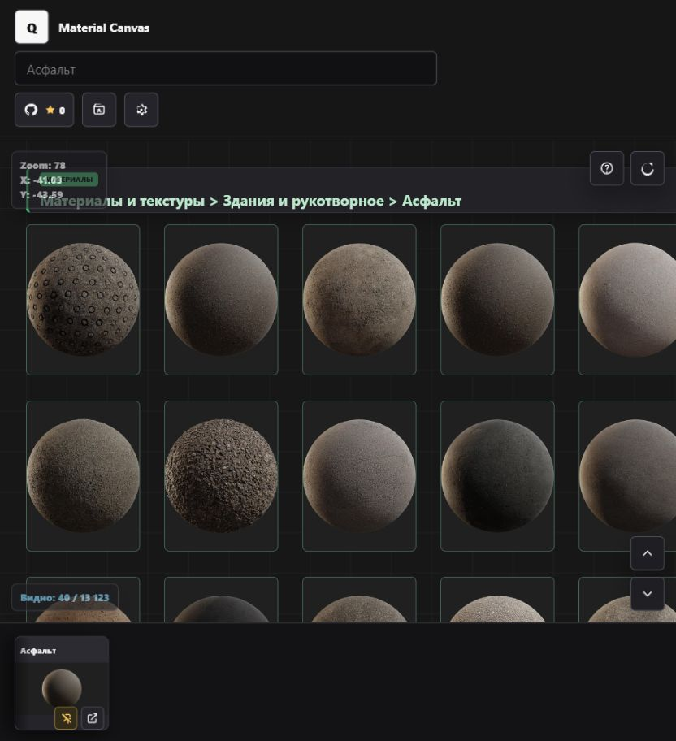

# Material Canvas

Material Canvas - статический React/Vite-инструмент для просмотра большой библиотеки Quixel-ассетов. Он помогает художнику искать, сравнивать, закреплять и раскладывать материалы, 3D-модели, декали и кисти по отдельным рабочим профилям.

[English README](README.md)



## Возможности

- Большой масштабируемый canvas с карточками ассетов и группировкой по локализованным путям категорий.
- Поиск с автодополнением, историей последних запросов, подсветкой совпадений и переходом к следующему результату.
- Профили в Local Storage: сохраняются zoom, позиция canvas, закрепленные карточки, свободные копии, поиск, фильтры, тема, язык и легкий режим карточек.
- Pinned-рука с защитой hover-состояния, увеличенными кнопками, перетаскиваемыми дубликатами и опциональным веером.
- Focus mode для чистого просмотра canvas.
- Переходы по категориям, сброс вида, счетчики видимых ассетов и компактные карточки на дальнем зуме.
- Фильтры по типам ассетов: материалы, 3D-модели, декали и кисти.
- Сгруппированный список подкатегорий с локализованными подписями без повторения полного пути в каждом пункте.
- Переключение интерфейса между английским и русским.
- Можно хостить как обычный статический сайт, backend не нужен.

## Горячие клавиши

- `Tab` принимает автодополнение поиска.
- `F3` или `Ctrl+G` переходят к следующему совпадению поиска.
- `R` сбрасывает вид canvas.
- `F` включает или выключает Focus mode.
- `/` открывает или закрывает окно подсказок.
- `E` включает или выключает легкие карточки.
- `Ctrl+Z` отменяет последнее действие на canvas.
- `1-9` загружает профили по порядку в списке.

## Локальный запуск

```bash
npm ci
npm run dev
```

Открой локальный URL, который покажет Vite. Данные ассетов загружаются из:

```text
public/data/assets.json
```

## Сборка

```bash
npm run build
npm run preview
```

Готовый сайт появится в папке `dist/`.

## GitHub Pages

В репозитории уже есть workflow `.github/workflows/pages.yml`.

1. Залей репозиторий на GitHub.
2. В настройках репозитория открой **Pages**.
3. В **Source** выбери **GitHub Actions**.
4. Сделай push в `master` или запусти workflow вручную.

В `vite.config.js` стоит `base: "./"`, поэтому сборка работает из project URL GitHub Pages, например:

```text
https://username.github.io/material-canvas/
```

## Данные

Файл `public/data/assets.json` намеренно содержит пример списка ассетов со статусом покупки. Профили и изменения пользователя никуда не отправляются: они сохраняются только в Local Storage браузера. Профили можно экспортировать и импортировать JSON-файлом из меню профилей.

## Благодарности и обратная связь

Material Canvas разработан при помощи ChatGPT Codex.

Issues, баг-репорты и предложения по фичам принимаются в GitHub-репозитории.
